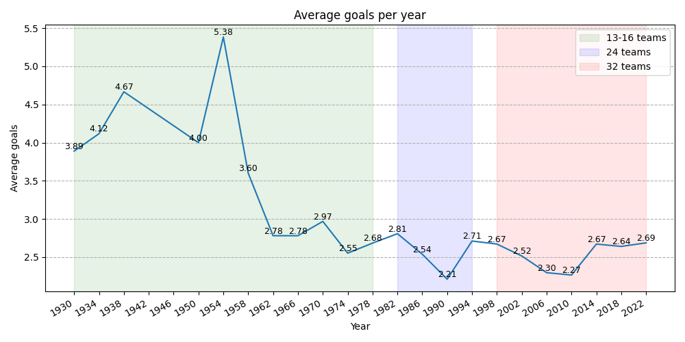
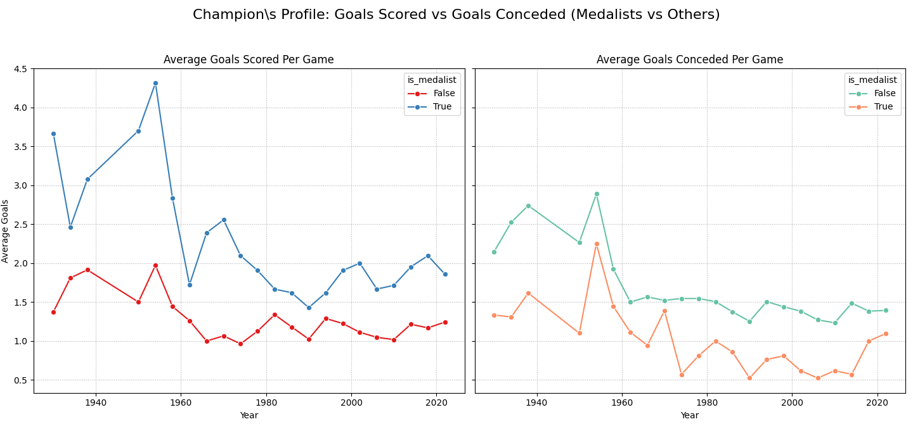
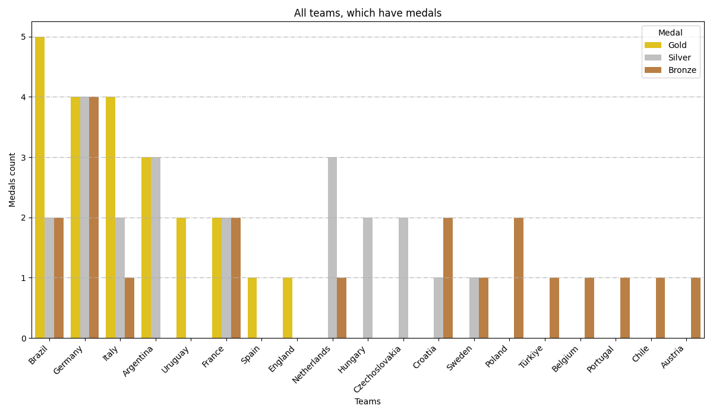
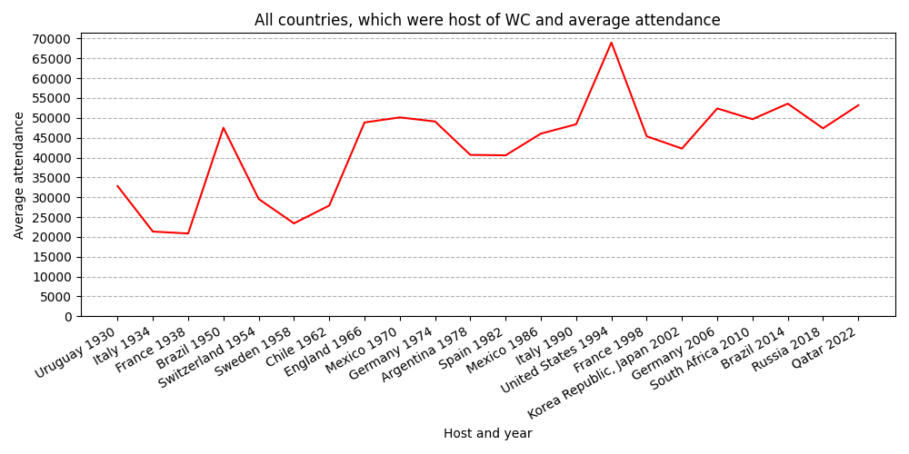

# ⚽ Analysis of FIFA World Cup History (1930-2022)

### Project Summary

This project analyzes all World Cup matches from 1930 to 2022 to find patterns in how the game has changed and to identify the statistical profile of the most successful teams.

### Data Source
- **FIFA World Cup 1930 - 2022 Dataset:** Provided by Kaggle. [Link to dataset](https://www.kaggle.com/datasets/piterfm/fifa-football-world-cup?select=matches_1930_2022.csv)

### Analysis & Key Findings

#### 1. Has Scoring in the World Cup Decreased Over Time?

The initial hypothesis was that scoring has been slowly dropping. The analysis shows a more nuanced story:
- **1930-1958:** An early "high-scoring" era with averages often exceeding **3.5 goals** per game.
- **1962-2022:** A modern, more tactical era where scoring dropped and has since **stabilized** around **2.5 goals** per game, despite changes to the tournament format.

 
*Caption: The chart clearly shows the drop and stabilization of goal-scoring averages, highlighting different tournament format eras.*

#### 2. What is the Statistical Profile of a Champion?
The analysis confirms a significant gap between medal-winning teams (1st-3rd place) and all other participants. In every tournament, the top teams consistently **score more goals** and **concede fewer goals** per game than other teams.

*Caption: Side-by-side comparison of average goals scored and conceded for medalist and non-medalist teams per tournament.*

## Conclusion

>Even though the game has become more strategic and has fewer goals than in the past, the way to win has not changed. This analysis shows that the best teams are the ones that are great at both scoring goals and stopping their opponents from scoring.

## PS. "Good to know" facts

## Tools Used

